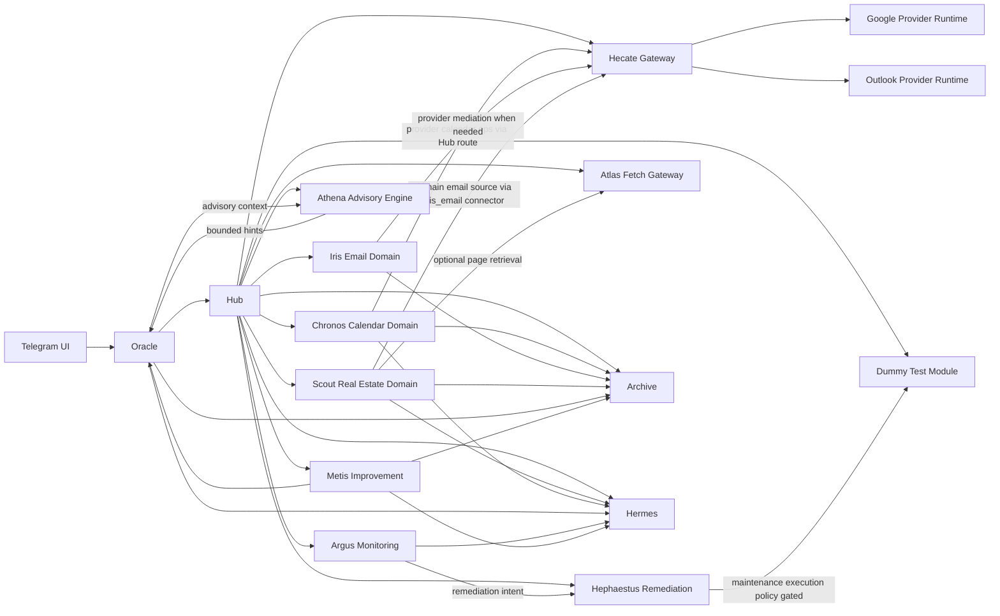

# Hestia Architecture and Flow Map

A quick, single-page reference for service roles, dependencies, and runtime data flow.

## Role Matrix

| Service | Role Type | Owns Business Logic | Owns Provider Runtime/Auth | Main Dependency Pattern |
|---|---|---|---|---|
| Hub | Core | No | No | Registry + routing for all services |
| Archive | Core | No | No | Persistent storage gateway |
| Oracle | Core | No | No | Uses Hub discovery and routes commands |
| Hermes | Core | No | No | Dispatches events/notifications |
| Telegram | Interface | No | No | User-facing chat/file relay to Oracle |
| Hecate | Core Gateway | No domain logic | Yes (Google/Outlook provider runtime) | Provider-facing gateway + connector runtime |
| Chronos | Domain (Calendar) | Yes (calendar workflows) | No | Routes provider calendar calls to Hecate |
| Iris | Domain (Email) | Yes (email workflows) | No (gateway-mediated when needed) | Exposes email-domain APIs and commands |
| Scout | Domain (Real Estate) | Yes (listing extraction/ranking) | No | Pulls domain email feed via Hecate connector path |
| Argus | Core Organ | Yes (monitoring/remediation intent policy) | No | Reads health/logs and emits remediation intents |
| Hephaestus | Core Organ | Yes (remediation execution policy) | No | Executes policy-gated remediation via Hub contracts |
| Athena | Core Organ | Yes (proactive advisory cognition) | No | Produces bounded advisory hints for Oracle |
| Atlas | Shared Integration | No domain logic | No | Host-side fetch helper routed via Hub |
| Metis | Core Organ | Yes (dataset curation, benchmark, training orchestration) | No | Builds datasets from feedback, runs benchmarks, orchestrates LoRA training |
| Dummy | Test Module | Generic integration testing behavior | No | Deterministic target for routing/policy/execution tests |
| Swagger | Documentation Aggregator | No | No | Canonical API contract surface (`swagger.yml`) |
| Shared | Shared Library | No | No | Common runtime/logging/startup helpers for services |

## Single Entry Point Rule (Provider Access)

1. Google and Outlook provider runtime/auth lifecycle are centralized in Hecate.
2. Domain services do not own direct provider SDK/OAuth runtime in their service boundary.
3. Domain APIs remain domain-owned:
   - Chronos owns calendar business operations.
   - Iris owns email business operations.
4. Scout consumes email-domain data through the Hecate connector flow (iris_email source), not by direct IMAP login in Scout.

## High-Level Dependency Graph

## Runtime Placement

| Node | Services |
|---|---|
| Raspberry Pi (always-on) | Hub, Archive, Oracle, Telegram, Hecate, Hermes, Chronos, Iris |
| Main PC (best-effort) | Scout and other domain modules, Metis, local LLM/runtime helpers |
| Host utility (outside Docker) | Atlas |

## Coverage Checklist

- Core: Hub, Archive, Oracle, Hermes, Telegram, Hecate
- Domain: Chronos, Iris, Scout
- Organ services: Argus, Hephaestus, Athena, Metis
- Utility/support: Atlas, Dummy, Swagger, Shared

## Practical Flows

### Calendar flow
1. Oracle/Telegram triggers calendar action.
2. Chronos handles calendar domain logic.
3. Chronos routes provider-facing calls to Hecate.
4. Hecate executes against Google/Outlook runtime.
5. Chronos persists normalized state in Archive and emits via Hermes when applicable.

### Email flow
1. Oracle/Telegram triggers email-domain action.
2. Iris handles email domain API semantics.
3. If provider mediation/runtime is needed, flow is routed through Hecate.
4. Scout reads domain email feed through Hecate connector path (`iris_email`) for extraction workflows.

### Real-estate extraction flow
1. Scout requests email-domain feed via Hecate connector runtime.
2. Scout runs pre-parse, dedupe, extraction, enrichment.
3. Scout writes entities to Archive and emits events to Hermes.

## Notes

- This file is a quick architecture map. Detailed endpoint contracts remain in each service `hestia-*.md` and in `Hestia-Swagger/swagger.yml`.
