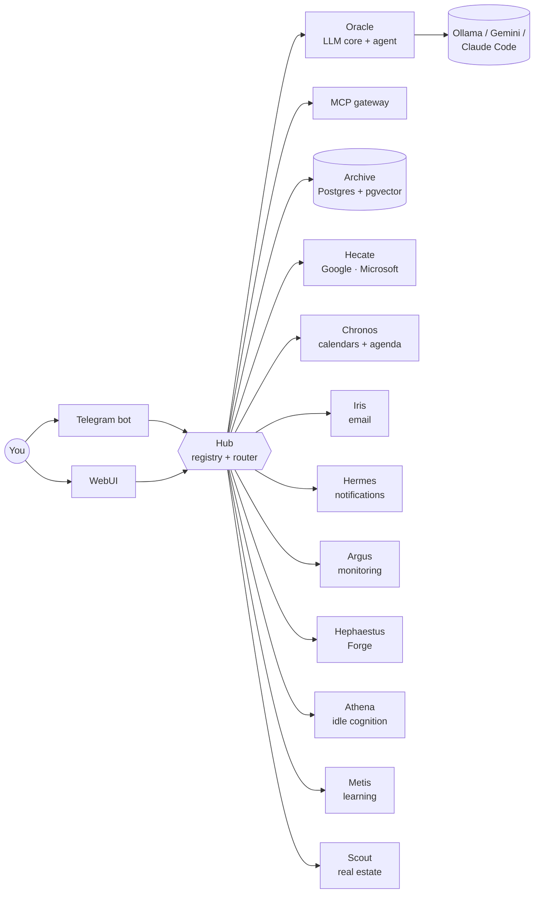
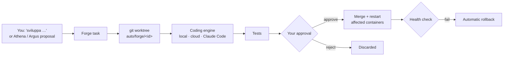

<div align="center">

# 🏛️ Hestia

**A self-hosted, local-first personal AI assistant that runs your agenda, reads your mail, watches itself — and develops its own code.**

[](https://github.com/SaibboRiginal/Hestia/actions/workflows/tests.yml)


[Features](#-features) ·
[Quick start](#-quick-start) ·
[Configuration](#%EF%B8%8F-configuration) ·
[Architecture](#-architecture) ·
[Roadmap](#-roadmap) ·
[Docs](#-documentation)

</div>

---

Hestia is a modular assistant made of small **FastAPI microservices** (plus a .NET/Angular web app) that run in
Docker on your own hardware — a PC, a home server, or a Raspberry Pi for the always-on core. You talk to it from
**Telegram** or the **WebUI**; a local model through **Ollama** does the thinking, with **Gemini** as a cloud
fallback and **Claude Code** as an optional coding engine.

What makes it different: Hestia **improves itself**. Ask *"sviluppa …"* ("build …") and its Forge opens a git
worktree, lets a coding engine implement the change, runs the tests, waits for your approval, merges, restarts
the affected containers and rolls back automatically if the health check fails.

## ✨ Features

| | |
|---|---|
| 💬 **Conversational agent** | One ReAct tool-calling loop over every service's tools (via an MCP gateway), visible thinking, streamed answers, file/photo understanding (PDF, images). |
| 🧠 **Long-term memory** | Selective, Claude-like memory in PostgreSQL + pgvector: the assistant decides what to remember and recalls it semantically. |
| 📅 **Calendars + its own agenda** | Unified CRUD over Google Calendar and Outlook. Hestia also keeps an *assistant agenda* where every module's schedule lives as data (events, tasks, recurring jobs, windows) that you can move, pause or skip. ICS feed for your phone. |
| ✉️ **Email** | Gmail via OAuth: search, threads, send. |
| 🔔 **Proactive notifications** | Subscriptions ("tell me when…"), deduplicated alerts, reminders, focus briefs. |
| 👁️ **Self-monitoring** | Argus watches health and logs, raises incidents and proposes fixes; Hephaestus runs guarded remediation. |
| 🛠️ **Self-development (Forge)** | Natural-language change requests → isolated branch → coding engine (local, cloud or Claude Code) → tests → your approval → merge → restart → auto-rollback. |
| 🧭 **Idle cognition** | Athena observes the system when you're not using it, scores ideas for relevance and proposes improvements. |
| 🦉 **Continuous learning** | Metis turns your feedback into datasets (ChatML/Alpaca/ShareGPT) and orchestrates LoRA training. |
| 🏠 **Domain modules** | Example: Scout reads real-estate listing emails, tracks listings and alerts you on matches. New domains are new services. |
| 🌐 **Two clients** | Telegram bot (fail-closed allow-list) and a themable WebUI: chat, commands, documents, Google-like calendar, Forge "Sviluppo" page with live transcripts and diffs. |

## 🚀 Quick start

### Prerequisites

- **Docker** with Compose v2 (Docker Desktop on Windows/macOS).
- **Python 3** on the host (only for the one-shot env setup script).
- **[Ollama](https://ollama.com)** running on the host (default `http://localhost:11434`).
- A **Telegram bot token** from [@BotFather](https://t.me/BotFather) and your numeric Telegram user id
  (e.g. from [@userinfobot](https://t.me/userinfobot)).

### 1. Clone and create the env files

```bash
git clone https://github.com/SaibboRiginal/Hestia.git
cd Hestia
python tools/init_env.py        # copies every .env.example to .env (never overwrites)
```

### 2. Set the minimum configuration

In `Hestia-Telegram/app/.env`:

```dotenv
TELEGRAM_BOT_TOKEN=<token from @BotFather>
ALLOWED_USER_ID=<your numeric Telegram id>
```

In the root `.env`, pick your own database password (URL-safe characters; it is applied when the database is
first created):

```dotenv
HESTIA_DB_PASSWORD=<a long random password>
```

In `docker-compose.global.yml`, set `NOTIFY_TARGET` (Hermes, Chronos) and `ARGUS_NOTIFY_TARGET` (Argus) to the
same Telegram id, so notifications reach you.

### 3. Pull the local models

```bash
ollama pull gemma4:e4b
ollama pull qwen3-embedding:0.6b
```

### 4. Start the stack

```bash
docker network create hestia_net
docker compose -f docker-compose.global.yml up -d --build
```

On Windows, `up-all.bat --build` does the same (network included); `up-all.bat` alone restarts everything after
a code change.

### 5. Say hi

- **Telegram:** write to your bot. Send `/webui_token` to get a login link for the web app.
- **WebUI:** <http://localhost:19015>
- **API docs (Swagger):** <http://localhost:19000>

That's it: everything else below is optional.

## ⚙️ Configuration

Every `.env` is documented in its `.env.example`, and every compose variable has an inline comment.

### Minimum

| Where | Variable | Purpose |
|---|---|---|
| `Hestia-Telegram/app/.env` | `TELEGRAM_BOT_TOKEN` | Bot token from @BotFather. |
| `Hestia-Telegram/app/.env` | `ALLOWED_USER_ID` | Who may talk to the bot. Empty = nobody (fail closed). |
| `docker-compose.global.yml` | `NOTIFY_TARGET`, `ARGUS_NOTIFY_TARGET` | Telegram chat id for reminders and alerts. |
| root `.env` | `HESTIA_DB_PASSWORD` | Postgres password (the DB port is bound to `127.0.0.1` only). |

### Optional integrations

| Feature | What to set | Notes |
|---|---|---|
| Cloud LLM fallback | `GEMINI_API_KEY` in `Hestia-Oracle/app/.env` | Used when the local model fails; also enables the Forge `cloud` engine. |
| Different local models | `MODEL_USECASE_*` in `Hestia-Oracle/app/.env` | Per use case: generic, reasoning, code, embedding (embeddings are fitted to 768 dims). |
| Google Calendar + Gmail | `HECATE_ENABLE_PROVIDER_GOOGLE=true` + OAuth client in `Hestia-Hecate/app/.env` | Step by step: [`Hestia-Hecate/hestia-hecate.md`](Hestia-Hecate/hestia-hecate.md) → *Google setup*. From the phone, ask the bot "collega Google Calendar". |
| Outlook calendar | `HECATE_ENABLE_PROVIDER_MICROSOFT=true` + `OUTLOOK_*` | Same file. |
| Claude Code as coding engine | `CLAUDE_CODE_OAUTH_TOKEN` in `Hestia-Oracle/app/.env` | From `claude setup-token` (Pro/Max). Forge then can use the `claude` engine. |
| Forge behaviour | `HEPHAESTUS_FORGE_*` in `Hestia-Hephaestus/app/.env` | Engine order, auto-rollback, deploy command. |
| WebUI hardening | `WEBUI_ADMIN_SECRET`, `WEBUI_SECRET_KEY`, `WEBUI_ICS_KEY` in the root `.env` | See [`Hestia-WebUI/hestia-webui.md`](Hestia-WebUI/hestia-webui.md). |
| Remote WebUI access | `cloudflare-tunnel.bat` | Quick Cloudflare tunnel to port 19015. |
| Resilient web fetching | Run Atlas on the host: `Hestia-Atlas/run_host.bat` / `run_host.sh` | Browser-assisted page fetching for modules. |
| Raspberry Pi core | `ARCHIVE_DATABASE_URL` in the root `.env`, then `docker compose -f docker-compose.rpi.yml up -d --build` | Always-on services only, external Postgres. |

## 🏗️ Architecture

Every service registers in the **Hub** and talks to the others only through it. **Oracle** is the only service
that calls model providers, **Archive** is the only owner of the database, **Hecate** is the only one that
touches external providers.



| Service | Port | Role |
|---|---|---|
| [Hub](Hestia-Hub/hestia-hub.md) | 19001 | Service registry, the only router, command discovery |
| [Archive](Hestia-Archive/hestia-archive.md) | 19002 | The only database owner: memory, entities, chat, calendar items, documents, feedback |
| [Hecate](Hestia-Hecate/hestia-hecate.md) | 19003 | Provider gateway: Google/Microsoft OAuth, Calendar, Gmail |
| [Oracle](Hestia-Oracle/hestia-oracle.md) | 19004 | LLM core: chat agent loop, memory, `/api/llm/*`, Claude Code runner |
| [Hermes](Hestia-Hermes/hestia-hermes.md) | 19005 | Event dispatch and notifications |
| [Scout](Hestia-Scout/hestia-scout.md) | 19006 | Domain module: real-estate listings from email |
| [Chronos](Hestia-Chronos/hestia-chronos.md) | 19007 | Calendars and the assistant agenda |
| [Argus](Hestia-Argus/hestia-argus.md) | 19008 | Health and log monitoring, alerts, repair rechecks |
| [Athena](Hestia-Athena/hestia-athena.md) | 19009 | Idle cognition: observe, think, propose |
| [Hephaestus](Hestia-Hephaestus/hestia-hephaestus.md) | 19010 | Guarded remediation and **Forge** (self-development) |
| [Dummy](Hestia-Dummy/hestia-dummy.md) | 19011 | Integration-test target |
| [Iris](Hestia-Iris/hestia-iris.md) | 19012 | Email domain logic |
| [MCP](Hestia-MCP/hestia-mcp.md) | 19013 | MCP gateway exposing every service's tools |
| [Metis](Hestia-Metis/hestia-metis.md) | 19014 | Datasets from feedback, benchmarks, LoRA training |
| [WebUI](Hestia-WebUI/hestia-webui.md) | 19015 | .NET 9 + Angular web client |
| [Swagger](Hestia-Swagger/swagger.yml) | 19000 | API contract of every service |
| [Telegram](Hestia-Telegram/hestia-telegram.md) | — | Main chat client |
| [Atlas](Hestia-Atlas/hestia-atlas.md) | host | Web fetch gateway running outside Docker |
| [Shared](Hestia-Shared/hestia-shared.md) | — | `hestia_common`: logging, startup, MCP helpers, agenda client |

Deeper dive: [dependency and flow map](architecture-and-flow-map.md) ·
[engineering rules and contracts](docs/ARCHITECTURE.md).

### How Hestia changes its own code



Permission modes per engine (`ask` · `auto` · `full_auto`) are set from Telegram, and autonomous Claude Code work
only runs inside agenda windows you control.

## 🗂️ Project structure

```
Hestia-<Name>/              one service: app/ (code), tests/, hestia-<name>.md, Dockerfile
Hestia-Shared/hestia_common shared libraries used by every Python service
Hestia-WebUI/               .NET 9 backend (app/) + Angular frontend (frontend/)
Hestia-Swagger/swagger.yml  API contract
docker-compose.global.yml   whole stack · docker-compose.rpi.yml  always-on core
docs/                       ARCHITECTURE.md, AI-GUIDE.md, work/ (task dossiers)
tools/                      init_env.py, governance checks
templates/                  service template used by create-service.bat
```

## 🧪 Development

```bash
# fast tests for one service (no network needed)
python -m pytest -q -m "unit or api or format" Hestia-Oracle/tests

# scaffold a new service that already follows the Hub contract (Windows)
create-service.bat Markets module 8012
```

- Test markers and plans: [`TESTING.md`](TESTING.md). CI runs every service's suite on each push.
- Governance checks (`tools/governance/`) keep docs, Swagger and command contracts in sync with code.
- Every task follows a small work protocol (spec, progress, changelog in `docs/work/`), described in
  [`CLAUDE.md`](CLAUDE.md) — written for AI developers, readable by humans.

## 🗺️ Roadmap

- **Real rollback for remediation**: Hephaestus runbook remediation still records rollback as metadata only
  (Forge already has true git revert).
- **Metis**: live benchmark runner, persistent datasets, built-in LoRA training script.
- **Argus fallback**: alert directly on Telegram when Oracle is down.
- **Persistent Hub registry**: today services re-register after a Hub restart.
- **Multi-node deployment**: shared Hub discovery across nodes, health-gated progressive rollout, automatic
  rollback on failed SLO checks.
- **More domain modules**: every new capability is a new service generated from the template.

## 📚 Documentation

| Topic | Where |
|---|---|
| Engineering rules and contracts | [`docs/ARCHITECTURE.md`](docs/ARCHITECTURE.md) |
| Full context for AI developers | [`CLAUDE.md`](CLAUDE.md) → [`docs/AI-GUIDE.md`](docs/AI-GUIDE.md) |
| Dependency graph and flows | [`architecture-and-flow-map.md`](architecture-and-flow-map.md) |
| Each service | `Hestia-<Name>/hestia-<name>.md` |
| API | [`Hestia-Swagger/swagger.yml`](Hestia-Swagger/swagger.yml) |
| WebUI design system | [`Hestia-WebUI/frontend/DESIGN-SYSTEM.md`](Hestia-WebUI/frontend/DESIGN-SYSTEM.md) |
| History | [`CHANGELOG.md`](CHANGELOG.md), [`docs/work/`](docs/work) |

## 📄 License

No license file has been published yet, so all rights are reserved by the author. Open an issue if you'd like to
use or contribute to Hestia.
